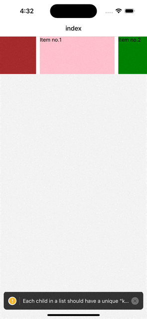

# Caraousal Banner

### Basic Carousel Code from which we can understand how the carousel is lopped in react-native-reanimated-carousel

#### To run the carousel direct copy Carousal.tsx file and BasicLayout.tsx in your code from component directory.

### Output:

