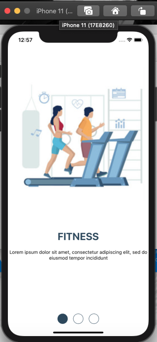
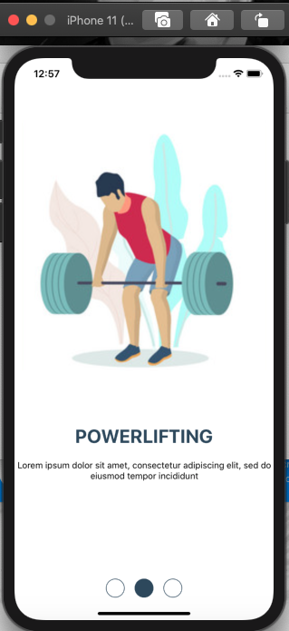
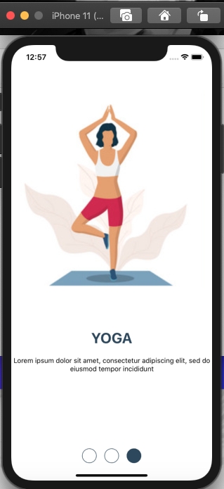

## Redux Architecture

## Create an onboarding screen provided in the link with following functionalities:

It will have an Image View, A text View and a dots view at the bottom.
On swiping, your image and text will change with fade in and fade out animation
Your dot indicator will also move as per gesture.
Should support both left and right swipes

### Output:

 

