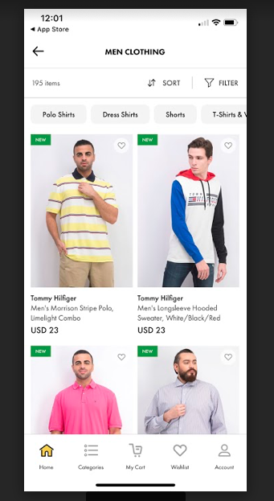
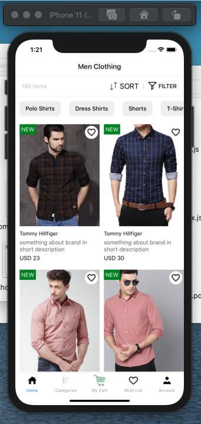

#### Create the above screen in React-Native:

Tab Navigation needs to integrated
Home tab must be selected
Icons can be fetched from icons8.com
Sort, filter, wishlist should be touchable
No need for back icon

#### Output:

