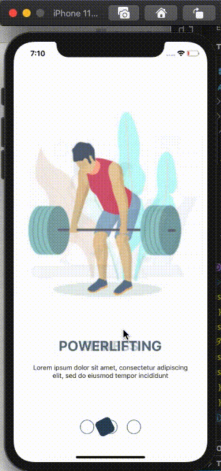

## React Native Component 6

### Create a draggable ball 

#### Output

### Create a map view
1.  Show your current location 
2. Set your current location on drag i.e,  current location functionality in zomato application.
3. Create an array of some static coordinates and show marker for those coordinates on map view.

#### Output

