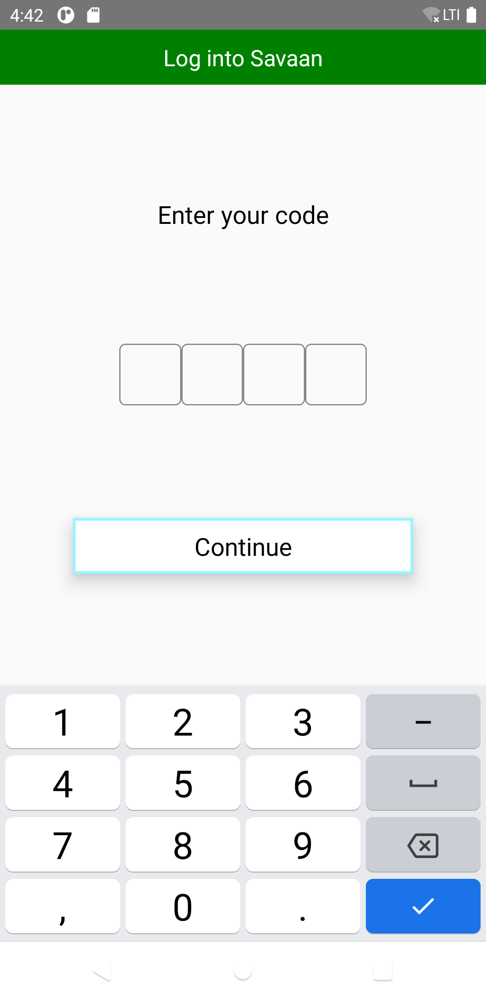

#React Native Debuging

## Exercise
1) Update the code structure 

2) Create a new Screen 

Add a button FETCH Data
On click present a loader and make an API call 
List the data on the same screen, existing button and loader should be removed
API Path : https://reqres.in/api/users

Method : GET 

Use fetch https://developer.mozilla.org/en-US/docs/Web/API/Fetch_API/Using_Fetch

### Output: 

     

     
     
